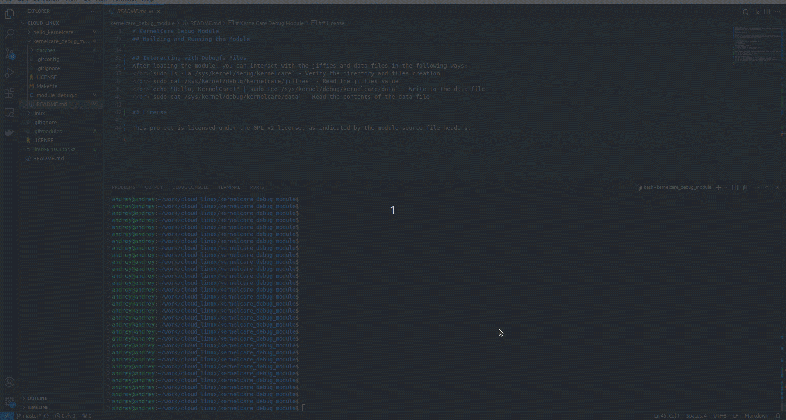

# KernelCare Debug Module
This repository contains a Linux kernel module that demonstrates the usage of debugfs by creating a subdirectory and files within it. The module creates two files in debugfs for monitoring jiffies and interacting with a data file.

## Bonus part

## Prerequisites
Before you can build and run this kernel module, ensure your system has the following software installed:
 `sudo apt-get install libncurses5-dev gcc make git libssl-dev bison flex libelf-dev bc zstd`
 The kernel headers corresponding to your running kernel version can usually be installed via your distribution's package manager:
 `sudo apt-get install --reinstall linux-headers-$(uname -r)`

## Checking CONFIG_DEBUG_FS
Before running the module, ensure that debugfs is enabled in your kernel:
 `cat /boot/config-$(uname -r) | grep CONFIG_DEBUG_FS`
 It should be:
 `CONFIG_DEBUG_FS=y`

## Checking Debugfs Mount
To verify that debugfs is mounted, run:
 `mount | grep debugfs`
 If nothing is returned, you can mount it manually using:
 `sudo mount -t debugfs none /sys/kernel/debug`

## Building and Running the Module

To build the module, use the provided Makefile with the following commands from the root directory of the project:
 `make all` # Compile the module
 `sudo make load` # Load the module into the kernel
 `sudo make unload` # Remove the module from the kernel
 `make clean` # Remove generated files

## Interacting with Debugfs Files
After loading the module, you can interact with the jiffies and data files in the following ways:
 `sudo ls -la /sys/kernel/debug/kernelcare` - Verify the directory and files creation
 `sudo cat /sys/kernel/debug/kernelcare/jiffies` - Read the jiffies value
 `echo "Hello, KernelCare!" | sudo tee /sys/kernel/debug/kernelcare/data` - Write to the data file
 `sudo cat /sys/kernel/debug/kernelcare/data` - Read the contents of the data file

## License

This project is licensed under the GPL v2 license, as indicated by the module source file headers.
